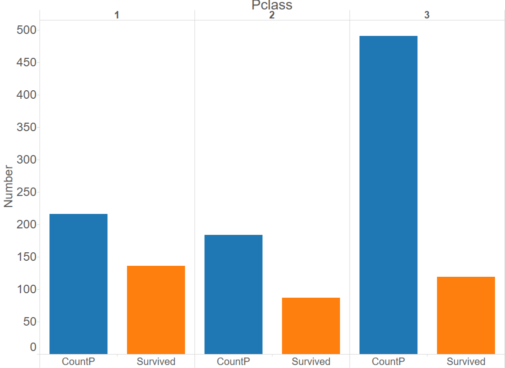
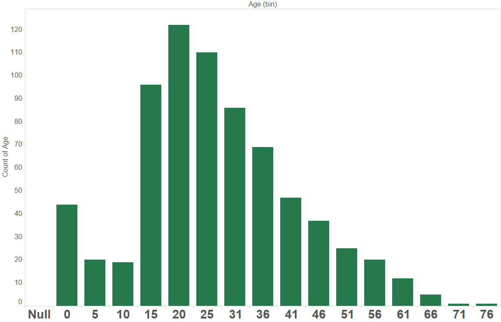
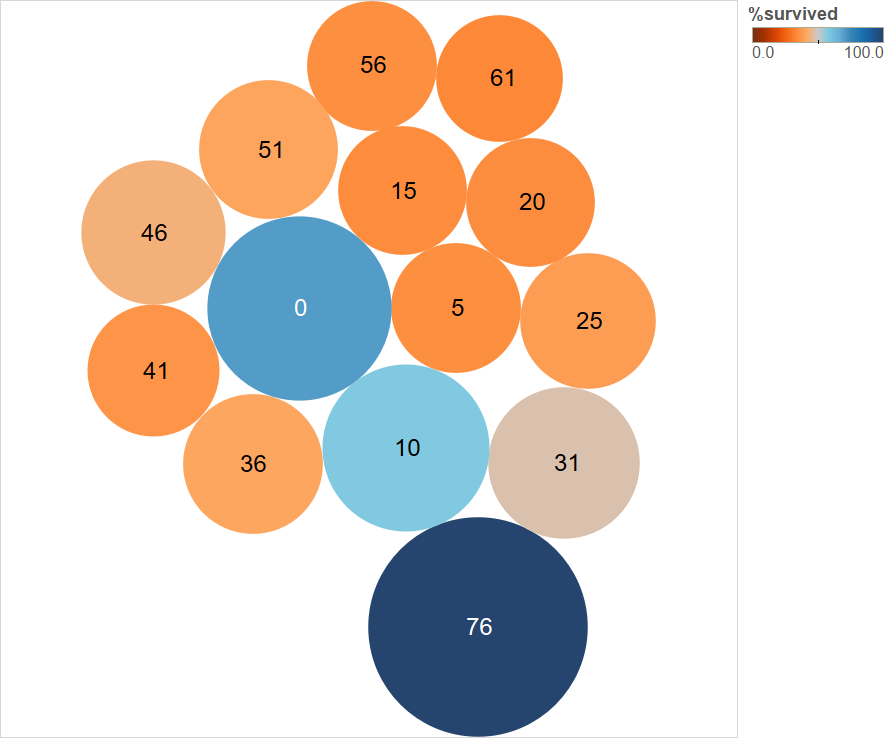
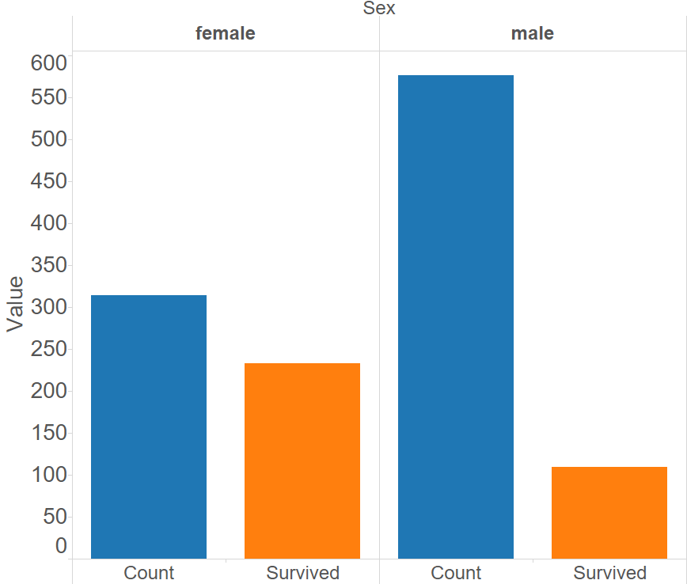
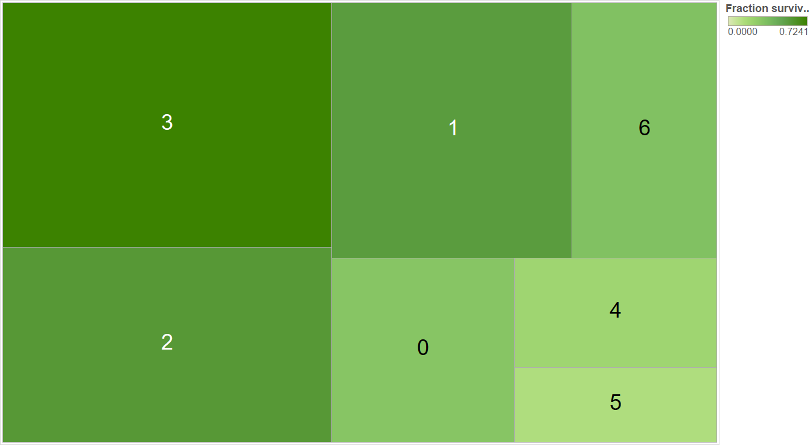
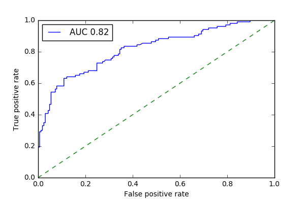
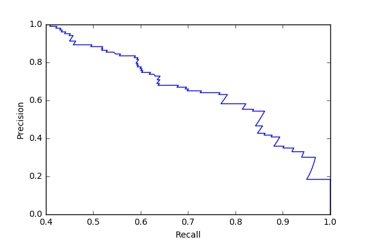
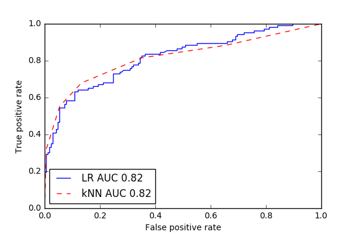

### Introduction

I will explore a dataset about various characteristics of the passengers on the ill-fated Titanic this week. A more comprehensive description of this dataset is available at [link](https://www.kaggle.com/c/titanic "Titanic Competition") and [link](https://www.kaggle.com/c/titanic/data "Titanic Data Description").

### Objective
There are 2 main goals of this study:

1. Understand which features affect survival
2. Build Logistic Regression, kNN and SVM models to predict survival and assess their accuracy

### Executive Summary
1. Passengers traveling in higher classes, females, older and younger passengers, passengers traveling alone or with small families all had a higher survival rate
2. The models built in this study are ~75-80% accurate in predicting passenger survival and non-survival

### Methodology
Here's the rough order of steps I followed in arriving at answers to these questions:

1. Data exploration
2. Data visualization and correlations
3. Data cleaning
4. Build models; assess performance
5. Optimize models and re-assess performance

### (0) Data acquisition
As part of Data Science Immersive bootcamp at General Assembly, the data from the Kaggle competition was made available to me in a PostgreSQL database stored on AWS. Here's a snippet of the code used to acquire the data and pull it into a Pandas dataframe:

```python
conn = psycopg2.connect("dbname='titanic' user='dsi_student' host='dsi.c20gkj5cvu3l.us-east-1.rds.amazonaws.com' password='xxxxx'")
pd.read_sql("SELECT * FROM information_schema.tables", con = conn);
df = pd.read_sql("SELECT * FROM train", con = conn)
```

### (1) Data exploration and cleaning
The "train" data contains 891 rows, with the following columns (descriptions from the Kaggle link):

"survival": Survival
                (0 = No; 1 = Yes)

"pclass": Passenger Class
                (1 = 1st; 2 = 2nd; 3 = 3rd)

"name": Name

"sex": Sex (male or female)

"age": Age

"sibsp": Number of Siblings/Spouses Aboard

"parch": Number of Parents/Children Aboard

"ticket": Ticket Number

"fare": Passenger Fare

"cabin": Cabin

"embarked": Port of Embarkation (C = Cherbourg; Q = Queenstown; S = Southampton)

**~38% of the passengers in this dataset survived, which is the baseline accuracy for survival. Any model must do much better than this for it to be useful.**

### (2) Data visualization

The dataframe was exported into Tableau for visualization. Here are some observations:

**Passengers in Classes 1 and 2 had a higher survival rate than passengers in Class 3**



**The survival rate was the highest among the youngest and the oldest passengers (by age), even though they were a small fraction of the total number of passengers**





**Females had a higher survival rate**



**Passengers with small families or those who were single (family size = "parch" + "sibsp") had a higher survival rate than people with larger families**



### (3) Data cleaning
The numerical features ("age", "fare", "SibSp" and "Parch") were all standardized (*sklearn.preprocessing.scale*), and null values were removed. The categorical features ("Pclass", "Embarked", "Sex") were converted to dummy features (*pd.get_dummies*). Other categoricals like "PassengerId", "Name" and "Cabin" were presumed to not contain any additional useful information for model building, and were ignored. A new dataframe "Xt" with the cleaned numerical and categorical data was assembled, and the labels (1 = Survived, 0 = Not survived) were stored in a separate dataframe "y".

### (4, 5) Model building and optimization

###### (A) Logistic regression
The first step was to split the dataset (which is the cleaned version of "train" table from the db, with the features chosen above) into training and test sets. (I only realized later that a separate "test" table was available from the database as well).

```python
# Train-test split
from sklearn.cross_validation import train_test_split

X_train, X_test, y_train, y_test  = train_test_split(Xt, y, stratify = y, test_size = 0.3)
```

Next, features for the logistic regression were selected using Recursive Feature Elimination with cross-validation (to avoid overfitting). 10 features were selected.

```python
# Select features (for logistic regression) from training set using RFECV
from sklearn.feature_selection import RFECV
from sklearn.linear_model import LogisticRegression

estimator = LogisticRegression()
selector = RFECV(estimator, cv = 5)
selector.fit(X_train, y_train)
col = selector.get_support()

# Transform X_train and X_test
X_train_RFECV = selector.transform(X_train)
X_train_best = pd.DataFrame(data = X_train_RFECV, columns = X_train.columns[col])
X_test_RFECV = selector.transform(X_test)
X_test_best = pd.DataFrame(data = X_test_RFECV, columns = X_test.columns[col])

# See which features were chosen
X_train_best.head(2)
```

Next, the model was trained on the training set, and the features with the highest absolute coefficients were obtained.

*The sex of the passenger and travel in passenger class 1 had the most impact on whether the passenger survived or not*.

Next, the performance of the model on the test set was assessed using various tools: classification report, confusion matrix, and AUC ROC.

**Classification report (LR)**

*The model is better at predicting "not survived" (0) than "survived" (1). Baseline accuracy for "survived" class is ~38%, and model predicts ~72%.*

|Label      |precision    |recall  |f1-score  |support|
|:---:|:---:|:---:|:---:|:---:|
|**0**|       0.79|      0.84|      0.82|       165|
|**1**|       0.72|      0.65|      0.68|       103|
|**avg / total**|       0.77|      0.77|      0.77|       268|


**Confusion matrix (LR, 0.5 threshold, accuracy)**

*The overall accuracy of the model (139+67)/(139+67+26+36) is 76.8%*

| |0 Pred|	 1 Pred|
|:---:|:---:|:---:|
|**0 Actual**|	139|	    26|
|**1 Actual**|	36|	    67|


**ROC curve (LR)**

*While the model is not perfect, it seems to do a good job maximizing the true positive rate while minimizing the false positive rate, at a decision threshold of 0.5*

```python
from sklearn.metrics import roc_curve, roc_auc_score

fpr, tpr, thresholds = roc_curve(y_test, model.decision_function(X_test_best))
area = roc_auc_score(y_test, model.decision_function(X_test_best))

plt.plot(fpr, tpr, label = "AUC %0.2f"%area)
plt.plot((0,1), (0,1), linestyle = "dashed")
plt.legend(loc = "best")
plt.xlabel("False positive rate")
plt.ylabel("True positive rate")
plt.show()
```



As a test case, the performance of the model at a decision threshold of 0.9 was assessed via a confusion matrix. As expected from the ROC curve, while the false positive rate was reduced, the true positive rate was reduced as well because the number of false negatives increased.

**Confusion matrix (LR, 0.9 threshold, accuracy)**

```python
y_pred_90 = [1 if y_prob[i][1] >= 0.9 else 0 for i in range(len(y_prob))]
pd.DataFrame(data = confusion_matrix(y_test, y_pred_90), index = ["0 Actu", "1 Actu"], columns = ["0 Pred", "1 Pred"])
```

| |0 Pred|	 1 Pred|
|:---:|:---:|:---:|
|**0 Actual**|	164|	    1|
|**1 Actual**|	82|	    21|


Next, the logistic regression model was optimized using GridSearchCV to find the optimal penalty ("L1" or "L2) and regularization hyperparameter C.

*The optimal penalty was L2, and the optimal C was 0.34. With these optimal parameters, the accuracy on the test set was still 76.9%, similar to what was obtained for the "unoptimized" logistic regression model.*

As another test case, the model was re-optimized using average precision as the scoring function instead of accuracy. The results are presented below.

*There was almost no change in the results.*

**Confusion matrix and Precision/Recall curve (LR, 0.5 threshold, average_precision)**

| |0 Pred|	 1 Pred|
|:---:|:---:|:---:|
|**0 Actual**|	138|	    27|
|**1 Actual**|	36|	    67|




###### (B) k-Nearest Neighbors (kNN)
An optimized kNN model was also built and assessed using the same steps as above.

*The best parameters from the GridSearchCV were n_neighbors = 5, and weights = 'uniform'. The overall accuracy on the test set was 79.5%, which is marginally better than the Logistic Regression model.*

*kNN does reasonably well in this case because the number of features selected for the model (10) is small in comparison to the number of training examples (623). If the number of features were much higher, then kNN would tend to overfit, whereas logistic regression could still perform well if regularized.*

**Confusion matrix (kNN)**

> | |0 Pred|	 1 Pred|
> |:---:|:---:|:---:|
> |**0 Actual**|	143|	    22|
> |**1 Actual**|	33|	    70|


**ROC curve (kNN)**



###### (C) SVM
An optimized SVM model was also built and assessed using the same steps as above.

*The best parameters from the GridSearchCV were kernel = rbf, and C = 1. The overall accuracy on the test set was 78.3%, which is marginally better than the Logistic Regression model.*


## Summary
All the models studied here performed similarly on this dataset, even with optimized hyperparameters. It would be interesting to study if there are any persistent trends in the misclassified data points, and see if additional features (like family size) help improve on these misclassifications. It would also be interesting to see if decision trees perform better than any of these methods on this dataset.
