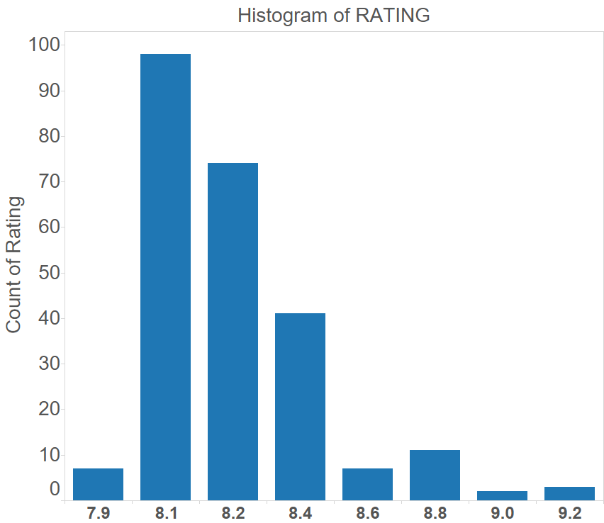
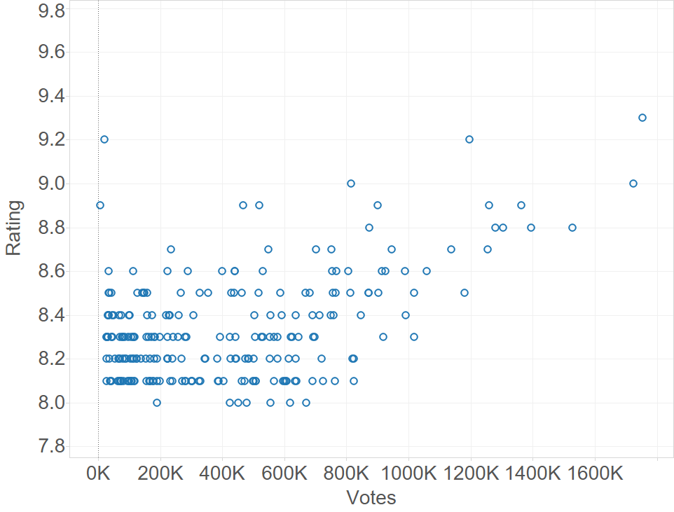
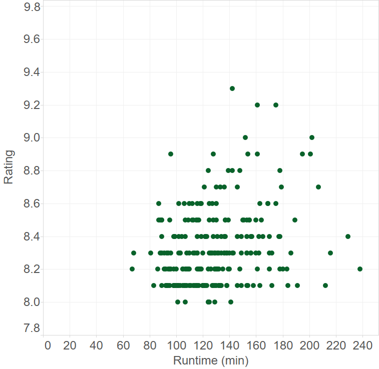
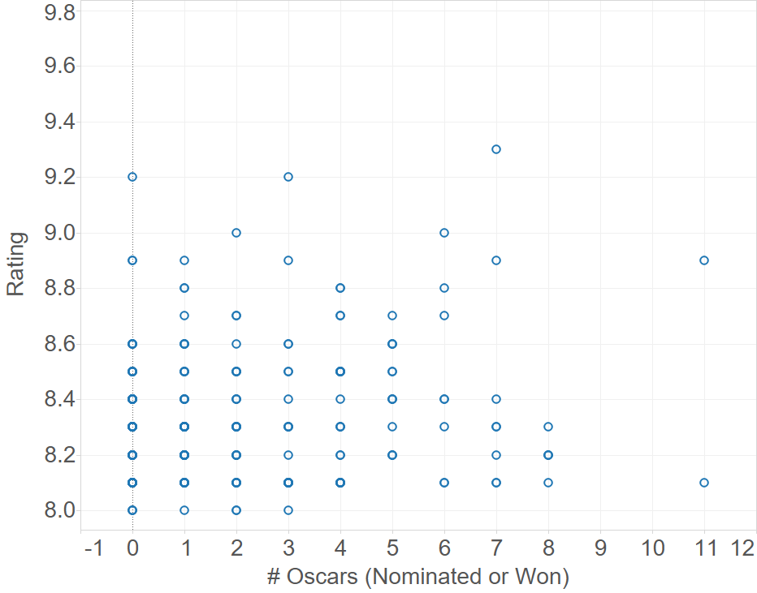
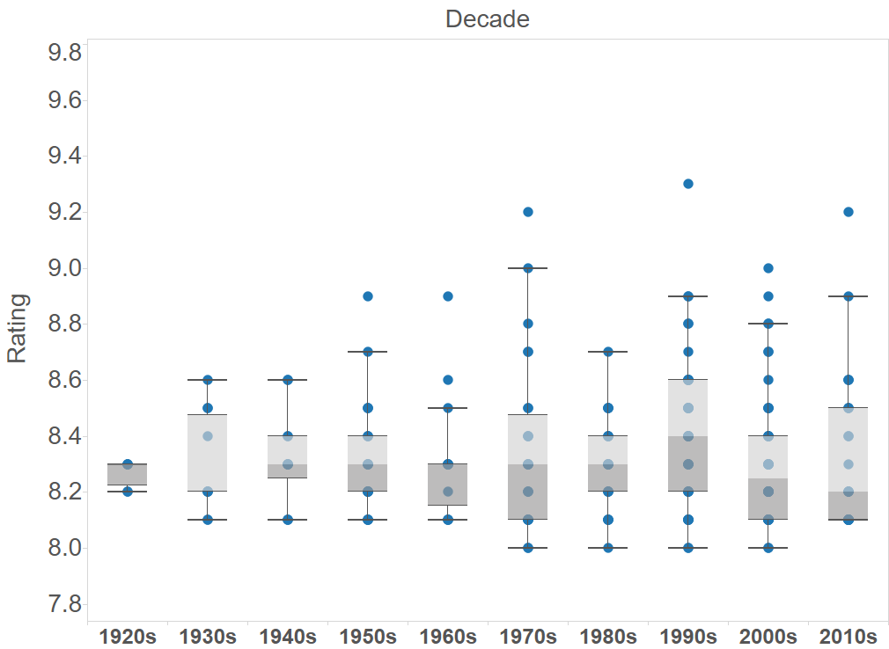
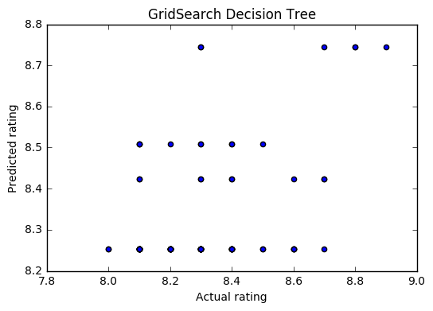
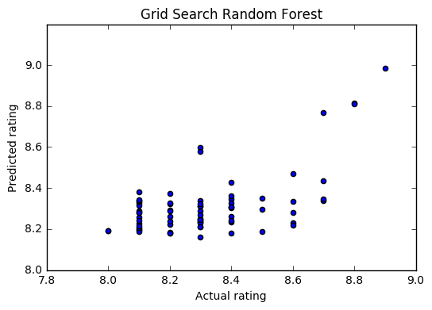
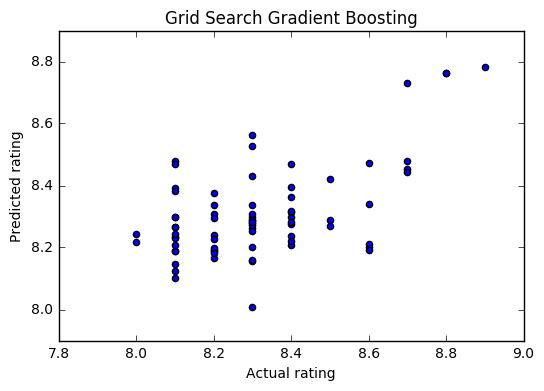
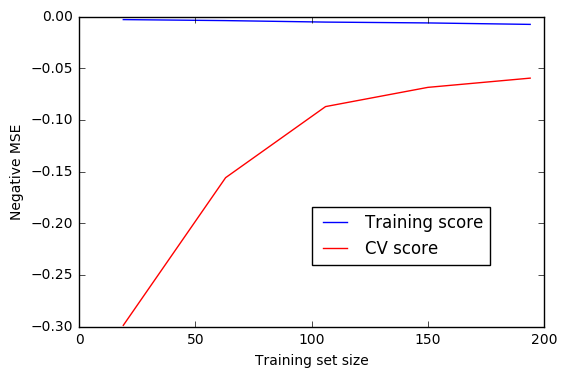

### Introduction

This week, I will explore ratings for the Top 250 movies of all time on IMDB. The goal is to see what characteristics of these movies correlate to their IMDB ratings. I will solely explore tree-based ML techniques in this post (decision trees and ensemble methods).

### Objective

There are 2 main goals of this study:

1. Build tree-based ML models to predict ratings, and assess their performance
2. Understand which features affect ratings for the best model (among the tree-based models)

### Executive Summary
1. An optimized Random Forest model performs best based on the chosen features, with MSE of 0.028 on the test set
2. **Number of votes**, and **movie runtime** are the 2 most important predictors for ratings
3. The optimized Random Forest is overfitting (with the chosen set of features), and the model error could be further reduced by training the model on a larger dataset

### Methodology
Here's the rough order of steps I followed in arriving at answers to these questions:

1. Data scraping
2. Data wrangling and feature engineering
3. Visualization (data exploration)
4. Model building and optimization

### (1) Data scraping
A table of the Top 250 movies was obtained directly from IMDB (http://www.imdb.com/chart/top) using Pandas. The movie names and year were extracted from the table using Regular Expressions, and the characteristics of each movie (runtime, genre, number of Oscars etc.) were obtained using the OMDB API (http://www.omdbapi.com/). Here's a snippet of the code used for this:

```python
# Get Top 250 movie table
df_aslist = (pd.read_html(url, attrs = {'class': 'chart full-width'}))
df = df_aslist[0]
# Obtain title for API search
name1 = [re.sub(r"[0-9]+\.", "", s) for s in df["Rank & Title"]]
name2 = [re.sub(r"\([0-9]+\)", "", s) for s in name1]
title = [s.strip() for s in name2]
# Movie details from OMDB API
response = []
for i, t in enumerate(title):
    response.append(requests.get("http://www.omdbapi.com/?t="+t+"&type=movie&y="+year[i]).text)
data = "[" + (",".join(response)) + "]"
movie = pd.read_json(data, orient = "records")
```

Here's a snapshot of the dataframe available after this step (not all columns displayed).

|Actors|	Awards|	Country|	Director|	Genre|	Language|	Runtime	|Title	|Writer	|Year	|imdbID|	imdbRating|	imdbVotes|
|:---:|:---:|:---:|:---:|:---:|:---:|:---:|:---:|:---:|:---:|:---:|:---:|:---:|
|Tim Robbins, Morgan Freeman, Bob Gunton, Willi...|Nominated for 7 Oscars. Another 19 wins & 30 n...|USA|Frank Darabont|Crime, Drama|English|142 min|The Shawshank Redemption|Frank Darabont|1994.0|tt0111161|9.3|1,754,270|

### (2) Data wrangling and feature engineering

There were 2 main aspects to this section:
1. Dealing with null and "N/A" values
2. Extracting features like number of Oscars won or nominated for, movie runtime, number of votes, genres, languages and decade of release

All predictors were converted to numerics if needed, because decision trees as implemented in Python's scikit-learn library only accept numerics as predictors. I hypothesized that other available features like director, actor, writer and plot keywords would not be direct predictors of ratings.

Here's a code snippet used for extracting the number of Oscars:

```python
# Extract number of Oscars (Nominarted for *OR* Won)
movie["oscar n/w"] = 0
for index, row in movie.iterrows():
    award_s = str(row.ix["Awards"]).split()

    if (award_s[0] == "Nominated") and ((award_s[3] == "Oscar.") or (award_s[3] == "Oscars.")):
        movie["oscar n/w"].loc[index] = int(award_s[2])
    elif award_s[0] == "Won" and ((award_s[2] == "Oscar.") or (award_s[2] == "Oscars.")):
        movie["oscar n/w"].loc[index] = int(award_s[1])
    else:
        movie["oscar n/w"].loc[index] = 0
```

And here's a code snippet for extracting movie genres:

```python
# Get genres using NLP
from sklearn.feature_extraction.text import CountVectorizer
import numpy as np

cvec = CountVectorizer()

df2_genre = pd.DataFrame(data = cvec.fit_transform(df2["Genre"]).todense(),
                        columns = cvec.get_feature_names())
# Merge "sci" and "fi", "Film" and "Noir"
df2_genre["sci-fi"] = df2_genre["sci"]
del df2_genre["sci"]
del df2_genre["fi"]
df2_genre["film-noir"] = df2_genre["noir"]
del df2_genre["film"]
del df2_genre["noir"]
```

### (3) Data exploration

The relationship of a number of predictors to the ratings was explored. Here are some observations:

**The ratings are skewed positive, and they are within a very tight range. It may be desirable to add more movies with ratings outside this range to better train the model**



**Ratings seem to be higher on average for movie that had more votes cast for them. It's not clear though which one is the predictor in this case (ratings, or votes), if indeed there's a causal relationship between the two**



**There seems to be an optimum runtime for movies with the highest ratings**



**There seems to be no correlation of ratings with number of Oscars (nominated or won)**



**There does not seem to be any correlation between ratings and the decade when the movie was released**



### (4) Model building and optimization

I built both base and optimized (GridSearchCV) regressor models using decision tree, Random Forest and Gradient Boosting. Here are code snippets to fit and evaluate the performance of all base and optimized models:

```python
# Function for all base models
def base_model(model, name, X_train, X_test, y_train, y_test):
    "Base model characteristics"
# CV scores
    scores = cross_val_score(model, X_train, y_train, cv = 5)
    print(name, "CV Score: ", scores.mean(), "+/-", scores.std())
# Feature importances    
    model.fit(X_train, y_train)
    df = pd.DataFrame(model.feature_importances_, index = X_train.columns, columns=['importance']).\
                        sort_values('importance', ascending=False)
    print(df[:5])
# Predictions
    y_pred = model.predict(X_test)
    print(name, "predicted MSE: ", mean_squared_error(y_test, y_pred))
    print(name, "predicted R2: ", r2_score(y_test, y_pred))
# Plot
    make_plot(y_test, y_pred, name)

# Function for all grid search models
def gs_model(model, name, X_train, X_test, y_train, y_test):
    "GridSearch model characteristics"
# Execute GridSearch
    model.fit(X_train, y_train)
    print("Best score: ", model.best_score_)
    print("Best params: ", model.best_params_)
# Predicted values
    y_pred = model.predict(X_test)
    print(name, "Predicted MSE: ", mean_squared_error(y_test, y_pred))
    print(name, "Predicted R2: ", r2_score(y_test, y_pred))
    make_plot(y_test, y_pred, name)
```

The following show the performance of these models. It's clear that an optimized base decision tree does not do well in predicting ratings, but the ensemble techniques (Random Forest and Gradient Boosting) greatly improve performance.







The MSE and R2 for all these models is shown below. The optimized Random Forest performs the best in this group.

|Method|MSE|R2 (predicted vs actual)|
|:----|:----:|:----:|
|Decision Tree|0.043|-0.013|
|GS Decision Tree|0.041|0.048|
|Random Forest|0.031|0.28|
|**GS Random Forest**|**0.028**|**0.34**|
|ExtraTrees|0.031|0.28|
|Gradient Boosting|0.029|0.32|
|GS Gradient Boosting|0.029|0.32|

The feature importances from the Random Forest model show that votes and runtime are the top 2 features for predicting ratings, as observed during data exploration.

|feature|importance    |
|:---:|:---:|
|votes  |      0.611595|
|time   |      0.072505|
|1950s   |     0.033383|
|english  |    0.027293|
|oscar n/w |   0.026068|

### Next steps

While it's clear that the ensemble models are performing better than the base decision tree models, the MSE and R2 still seem high and low respectively for the best model. There are a couple of options at this stage: either collect more training data (if model suffers from a variance problem), or increase model complexity (if model suffers from a bias problem). A third option may be to engineer a new set of features if neither of these is feasible.

A learning curve on the optimized Random Forest seems to suggest that while training error is low, CV error is still high, indicating a potential variance problem with the current model. Additional training data, if available, would help in this case.


