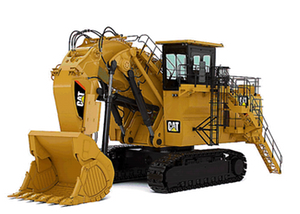
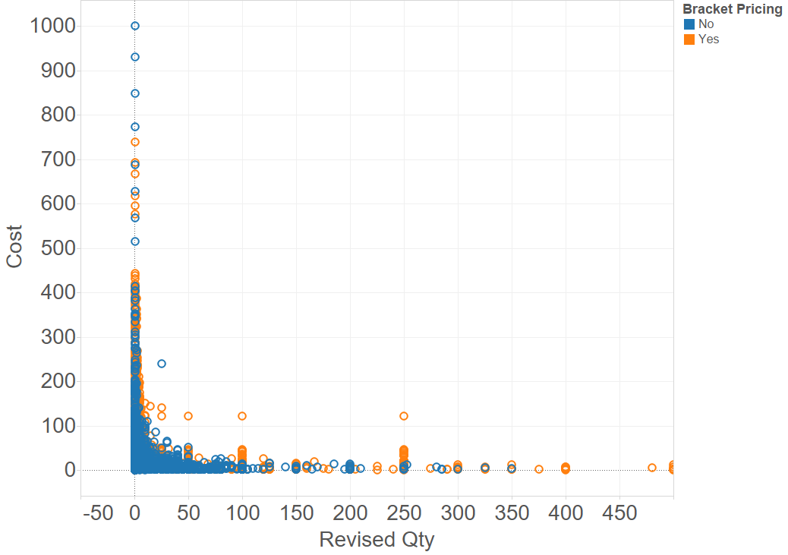
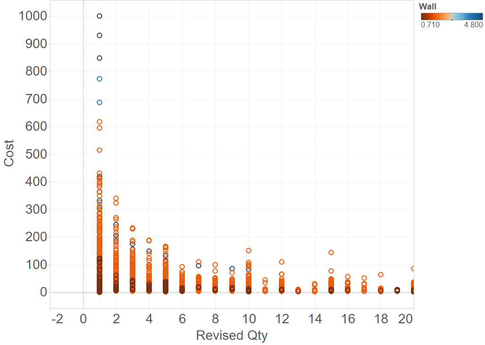
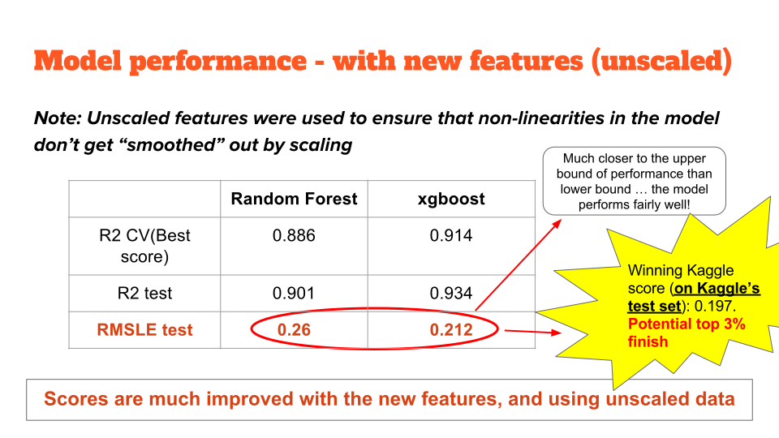
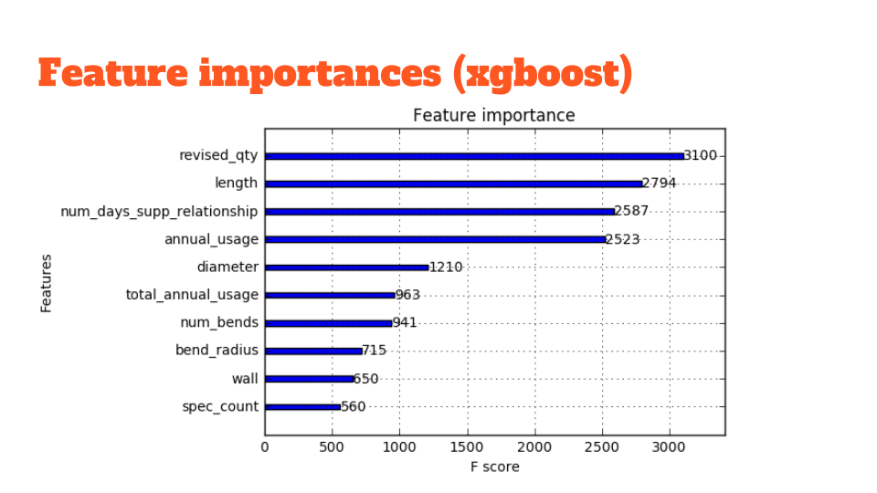
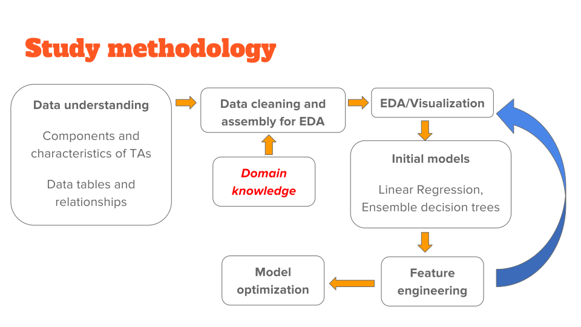
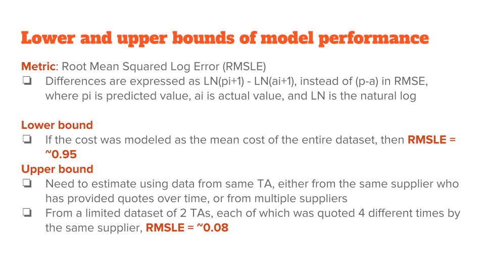
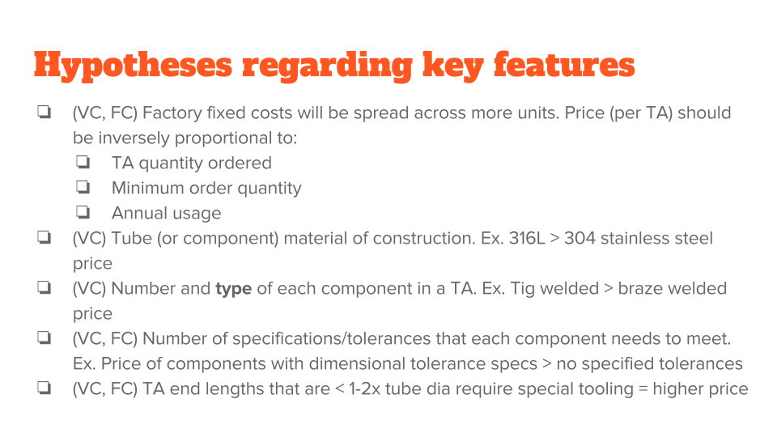
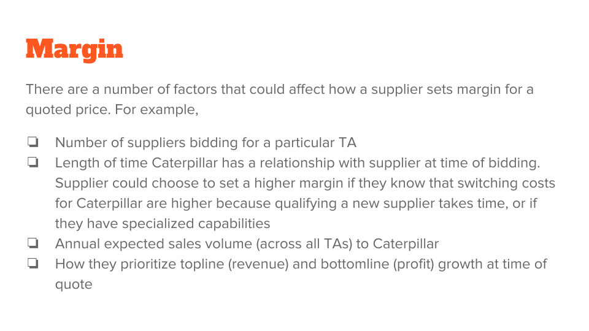

### Introduction

This is my Capstone project for General Assembly's full-time 12-week Data Science Immersive course. It is heavily inspired by a 2015 Kaggle competition (<a href="https://www.kaggle.com/c/caterpillar-tube-pricing"><b>Kaggle Caterpillar tube assembly pricing</b></a>), but with some additional goals. I wanted to create not just a pricing model, but also:

a) Clearly formulate and explain key hypotheses regarding factors that drive price

b) Understand and set lower and upper bounds for model performance

c) Show how and **why** key steps in cleaning, EDA, feature engineering, model building and optimization were executed

d) Understand the main factors that drive pricing, and present recommendations based on these

Here's a picture of a typical tube assembly that is used to pneumatically control various operations in Caterpillar's mining and construction equipment.

### Report Organization

I will present some key steps and results in this post. A detailed presentation covering all the points listed above is hosted on slideshare, at the link below.

<iframe src="//www.slideshare.net/slideshow/embed_code/key/8uSORsIg26t0lh" width="595" height="485" frameborder="0" marginwidth="0" marginheight="0" scrolling="no" style="border:1px solid #CCC; border-width:1px; margin-bottom:5px; max-width: 100%;" allowfullscreen> </iframe> 
 <strong> <a href="//www.slideshare.net/KarthikVenkataraman11/kaggle-caterpillar-tube-assembly-pricing" title="Kaggle Caterpillar tube assembly pricing" target="blank">Kaggle Caterpillar tube assembly pricing</a> </strong> from <strong><a target="blank" href="//www.slideshare.net/KarthikVenkataraman11">Karthik Venkataraman</a></strong> 

### Executive Summary

Quoted price is a strongly non-linear function of various factors.
1. Order quantity is the most significant factor affecting quoted price
2. Tube assembly diameter and length are important predictors of price, are likely a proxy for amount of material used in building tube assemblies
3. Annual usage (per tube assembly), total annual usage (per supplier) and the length of time Caterpillar has had a relationship with supplier, all play a role in price
4. An important area of focus for price negotiations/reductions should be larger diameter tube assemblies ... bulk procurement of these would help
5. Materials of construction don't seem to significantly affect price. This may present an opportunity to 'upscale' materials for performance reasons if desired by the technical team, without significant price impact

### Key results

Price is strongly dependent on quantity ordered.

Certain component types (ex. CP-028 - straight adapter) are predominantly present in higher quantities in lower priced assemblies.

Parts with higher wall thickness (= more material) seem to be priced higher.

An Extreme Gradient Boosting (xgboost) model performs very well with the right features (note: R2 refers to the fit between predicted and actual costs)

Feature importances from an optimized xgboost model are shown below.

### Discussion

I want to briefly discuss some learnings from planning and executing this project.

Firstly, coming up with a methodical high-level plan of attack really helped. Without this, it would have been easy to get lost in the weeds of EDA, model building or optimization without making timely progress. It also helped to set clear lower and upper bounds for model performance targets. Any model that performs worse than the lower bound is useless. And the upper bound helps guide decision-making along the way - for ex. is it worth spending more time on model optimization.

Secondly, thinking through the lens of cost breakdowns from the supplier's perspective helped formulate key hypotheses to explore. It not only helped to articulate hypotheses to test during EDA, but was also instrumental in engineering the right features for a good predictive model. (Note: VC is variable cost, FC is fixed cost, M is margin in the images below)

Lastly, from a model building and optimization perspective, log transformation of the target variable (price) really helped in building a better nonlinear model. It was also important to realize that using a linear combination of features as inputs (i.e. PCA), and scaling the data prior to model fitting actually hurt model performance in this case. In the case of scaling, this could be due to potentially 'smoothing' out any non-linearities by transforming to a scaled feature space. In the case of PCA, using a linear combinations of features may have resulted in choosing the wrong features to combine non-linearly in the model.
