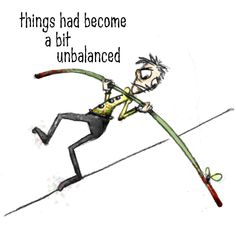

### Introduction

There are a number of areas where the occurrence of the phenomena of interest is much rarer and less frequent than, well, the less interesting stuff. For example,  less than 1% of all credit card transactions are fraudulent. Similarly, product defect rates in a well-run factory production line, or the occurrence of rare diseases in the general population can all be less than 1%. In such cases, naively building a machine learning classifier to detect fraud or predict defects can lead to poor performance, or in the worst case, provide a false sense of security by masking poor performance.

I recently ran into unbalanced classes while working on a machine learning model to predict antibody-antigen binding in biological systems. So I thought it may be useful to document my learnings, and present other posts that helped me get started on this topic.

### Classifier performance metrics

One of the first things to realize is that using accuracy as a metric for optimizing or assessing model performance in these cases can be very misleading. If only 1% of transactions in the available dataset are fraudulent, then it is very easy to achieve a 99% accuracy on the model by classifying every transaction as "not fraud". However, all the model is learning is the underlying class distribution. As you can imagine, this is not terribly useful. Don't be fooled by a high accuracy value!

The AUC (Area Under Curve) of a ROC (Receiver Operating Characteristics) plot, which is a plot of the True Positive Rate against the False Positive Rate for different thresholds, is a better metric to use (note that the default confusion matrix generated in most libraries, like the popular ```
sklearn```
in Python, use a 0.5 threshold). F1-score, which is the harmonic mean of precision and recall, is another metric to consider.

See <a href="https://www.svds.com/the-basics-of-classifier-evaluation-part-1/"><font color="008000"><b>Basics of Classifier Evaluation</b></font></a> for a more in-depth explanation of the pitfalls of using accuracy as a metric.

### Algorithms

There are a number of points to consider from an algorithm perspective while dealing with unbalanced classes.

1. First, ensure that the underlying class distribution is represented in every fold during cross-validation. In ```sklearn```, this can be done by using ```StratifiedKFold``` for generating the folds. Note that this gets tricky if the same group is not to be represented in both the training and cross-validation sets. For example, if the same binding sites of an antibody are represented in both the training and CV sets, then the classifier may overfit and not generalize well to new antibodies. In such cases, ```GroupKFold``` should be used (see official <a href="http://scikit-learn.org/stable/modules/cross_validation.html#group-k-fold"><font color="008000"><b>sklearn GroupKFold</b></font></a> documentation).

2. An easy way of giving higher importance to the rare/minority class, i.e. penalizing its errors more than the other class during the algorithm's cost function minimization, is to adjust class weights. As expected, this only has an effect on reducing False Negatives, not False Positives (assuming that the minority class is labeled Positive). In many popular ```sklearn``` models like ```RandomForestClassifier```, simply set the ```class_weight``` to a value higher than 1 (or pass a dictionary of values during gridsearch). Note that in ```xgboost```, class weights are referred to as ```scale_pos_weight```, and in ```GradientBoostingClassifier```, class weight is only available in the ```.fit``` method as ```sample_weight```.

3. There are a number of techniques to make the dataset more 'balanced' prior to running models. <a href="http://www.marcoaltini.com/blog/dealing-with-imbalanced-data-undersampling-oversampling-and-proper-cross-validation"><font color="008000"><b>This blog post</b></font></a> provides a good discussion of undersampling (the majority class) and oversampling (the minority class), and how to perform cross-validation when using these techniques. In addition, the general references listed at the end of my post provide links to other techniques that fall in this realm. Note that Python has a <a href="https://github.com/scikit-learn-contrib/imbalanced-learn"><font color="008000"><b>imbalanced-learn</b></font></a> package that contains a number of these techniques.

4. Viewing the minority class data points as outliers or anomalies provides another option for modeling the data. In this approach, the goal is to generate a decision boundary around the majority class data points, and designate anything outside this boundary as the minority class. <a href="https://www.youtube.com/watch?v=h5iVXB9mczo"><font color="008000"><b>Andrew Ng</b></font></a> provides a great introduction to this topic by using a Gaussian distributed dataset example. The ```sklearn``` package in Python (<a href="http://scikit-learn.org/stable/modules/outlier_detection.html"><font color="008000"><b>Novelty and Anomaly detection</b></font></a>) supports 3 different methods - ```OneClassSVM```, ```EllipticEnvelope```, and ```IsolationForest```. The ```IsolationForest``` method implements an interesting idea -- the number of partitions/path length required to isolate any data point, averaged over many trees, is shorter for anomalies than for 'normal' points. Note that the method described by Andrew Ng in his lecture can be implemented by using the ```EllipticEnvelope``` method.

  Take care to recast the minority class labels as -1 and majority class labels as +1 prior to running any of these 3 methods, as opposed to +1 for the class of interest and 0 for others in most typical ```sklearn``` method implementations. Another note on implementation ... it's possible for ```EllipticEnvelope``` to throw a 'Singular covariance matrix' exception -- this is a known issue with the method implementation if the data is not in an n-dimensional ellipsoid shape.

  <a href="http://sdsawtelle.github.io/blog/output/week9-anomaly-andrew-ng-machine-learning-with-python.html"><font color="008000"><b>This article</b></font></a> has a couple of additional notes on implementing anomaly detection techniques, as well as other references on this topic.  

### References

I'll end this post with a couple of overview articles that helped me understand this topic better, and make progress on my antibody-antigen binding project.

<a href="https://www.svds.com/learning-imbalanced-classes/"><font color="008000"><b>Tom Fawcett - Learning from Imbalanced Classes</b></font></a>

<a href="http://machinelearningmastery.com/tactics-to-combat-imbalanced-classes-in-your-machine-learning-dataset/"><font color="008000"><b>Jason Brownlee - Combat Imbalanced Classes</b></font></a>

<a href="https://www.quora.com/In-classification-how-do-you-handle-an-unbalanced-training-set#!n=12"><font color="008000"><b>Quora - Unbalanced Classes</b></font></a>
